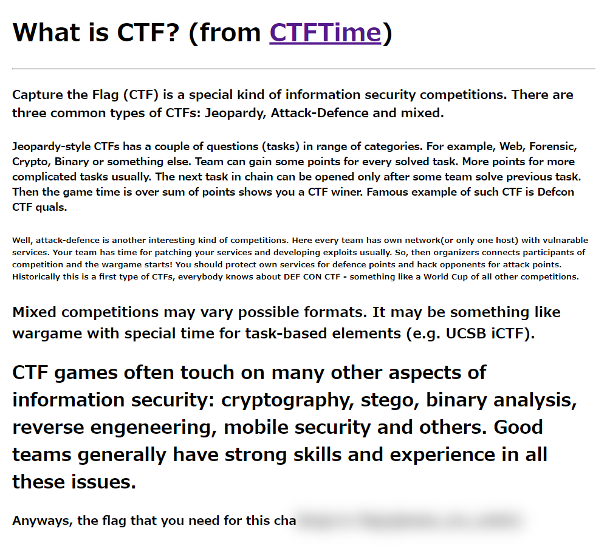

# Blurry Eyes

100pt (1193 Solves)

```txt
I can't see :(

https://blurry-eyes.web.hsctf.com

Author: meow
```

## 概要



モザイクかかってる。
モザイク周辺のhtmlは以下

```html
<h4>
    Anyways, the flag that you need for this cha
    <span class="blur">
        llenge is: <span class="poefKuKjNPojzLDf"></span>
    </span>
</h4>
```

## 解

style.cssでclass値`poefKuKjNPojzLDf`を検索する。

```css
.poefKuKjNPojzLDf:after {
    content: "f" "l" "a" "g" "{" "g" "l" "a" "s" "s" "e" "s" "_" "a" "r" "e" "_" "u" "s" "e" "f" "u" "l" "}" ;
}
```

```txt
flag{glasses_are_useful}
```
