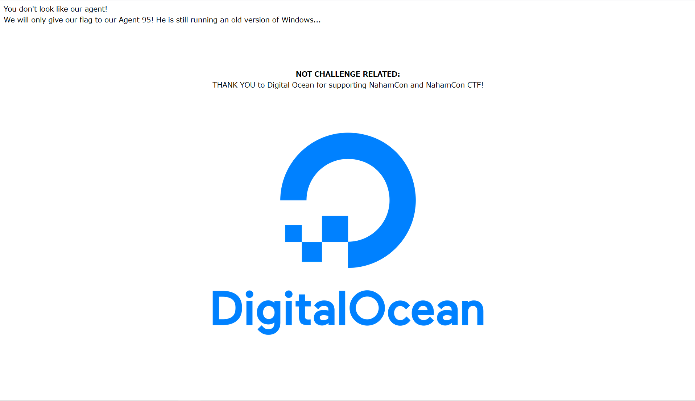

# Agent 95

50pt (1788 Solves)

```txt
They've given you a number, and taken away your name~
```

## 概要



アクセスしたときのGETリクエストが以下。

```txt
GET / HTTP/1.1
Host: jh2i.com:50000
User-Agent: Mozilla/5.0 (Windows NT 10.0; Win64; x64; rv:77.0) Gecko/20100101 Firefox/77.0
Accept: text/html,application/xhtml+xml,application/xml;q=0.9,image/webp,*/*;q=0.8
Accept-Language: ja,en-US;q=0.7,en;q=0.3
Accept-Encoding: gzip, deflate
Connection: close
Upgrade-Insecure-Requests: 1
Cache-Control: max-age=0
```

## 解

useragentを見てるっぽい。「95...？」となったが、  
`useragent 95`とかでググればWin95のuseragentがでてくるので書き換えたらflag。

```txt
GET / HTTP/1.1
Host: jh2i.com:50000
User-Agent: Mozilla/1.22 (compatible; MSIE 2.0; Windows 95)
(snip)
--------------------------------------------------------------
HTTP/1.1 200 OK
Date: Fri, 12 Jun 2020 17:54:23 GMT
Server: Apache/2.4.38 (Debian)
Vary: Accept-Encoding
Content-Length: 337
Connection: close
Content-Type: text/html; charset=UTF-8

flag{user_agents_undercover}
(snip)
```
