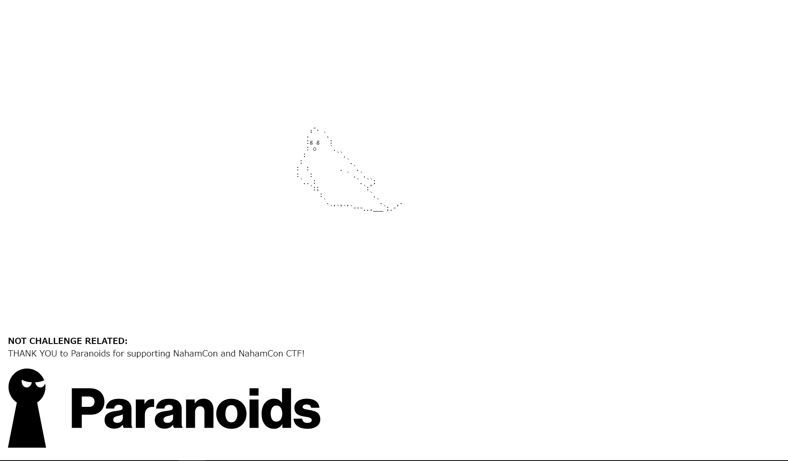

# Localghost

75pt (1375 Solves)

```txt
BooOooOooOOoo! This spooOoOooky client-side cooOoOode sure is scary! What spoOoOoOoky secrets does he have in stooOoOoOore??

Connect here: [url]

Note, this flag is not in the usual format.
```

## 概要



スクロールすると無限に幽霊がでてくる。

## 解

幽霊を出す処理をしてるjsを読み込んでる所がある。

```html
<script src="/jquery.jscroll2.js"></script>
```

`/jquery.jscroll2.js`にアクセスするとASCIIっぽい配列がある。

```js
var _0xbcec=["\x75\x73\x65\x20\x73\x74\x72\x69\x63\x74","\x6A\x73\x63\x72\x6F\x6C\x6C","\x3C\x73\x6D\x61\x6C\x6C\x3E\x4C\x6F\x61\x64\x69\x6E\x67\x2E\x2E\x2E\x3C\x2F\x73\x6D\x61\x6C\x6C\x3E","\x61\x3A\x6C\x61\x73\x74","","\x66\x6C\x61\x67","\x53\x6B\x4E\x55\x52\x6E\x74\x7A\x63\x47\x39\x76\x62\x32\x39\x76\x61\x33\x6C\x66\x5A\x32\x68\x76\x63\x33\x52\x7A\x58\x32\x6C\x75\x58\x33\x4E\x30\x62\x33\x4A\x68\x5A\x32\x56\x39","\x73\x65\x74\x49\x74\x65\x6D","\x6C\x6F\x63\x61\x6C\x53\x74\x6F\x72\x61\x67\x65","\x64\x61\x74\x61","\x66\x75\x6E\x63\x74\x69\x6F\x6E","\x64\x65\x66\x61\x75\x6C\x74\x73","\x65\x78\x74\x65\x6E\x64","\x6F\x76\x65\x72\x66\x6C\x6F\x77\x2D\x79","\x63\x73\x73","\x76\x69\x73\x69\x62\x6C\x65","\x66\x69\x72\x73\x74","\x6E\x65\x78\x74\x53\x65\x6C\x65\x63\x74\x6F\x72","\x66\x69\x6E\x64","\x62\x6F\x64\x79","\x68\x72\x65\x66","\x61\x74\x74\x72","\x20","\x63\x6F\x6E\x74\x65\x6E\x74\x53\x65\x6C\x65\x63\x74\x6F\x72","\x74\x72\x69\x6D","\x73\x72\x63","\x69\x6D\x67","\x66\x69\x6C\x74\x65\x72","\x6C\x6F\x61\x64\x69\x6E\x67\x48\x74\x6D\x6C","\x6C\x65\x6E\x67\x74\x68","\x2E\x6A\x73\x63\x72\x6F\x6C\x6C\x2D\x69\x6E\x6E\x65\x72","\x3C\x64\x69\x76\x20\x63\x6C\x61\x73\x73\x3D\x22\x6A\x73\x63\x72\x6F\x6C\x6C\x2D\x69\x6E\x6E\x65\x72\x22\x20\x2F\x3E","\x77\x72\x61\x70\x41\x6C\x6C","\x63\x6F\x6E\x74\x65\x6E\x74\x73","\x70\x61\x67\x69\x6E\x67\x53\x65\x6C\x65\x63\x74\x6F\x72","\x68\x69\x64\x65","\x63\x6C\x6F\x73\x65\x73\x74","\x6A\x73\x63\x72\x6F\x6C\x6C\x2D\x6E\x65\x78\x74\x2D\x70\x61\x72\x65\x6E\x74","\x61\x64\x64\x43\x6C\x61\x73\x73","\x2E\x6A\x73\x63\x72\x6F\x6C\x6C\x2D\x69\x6E\x6E\x65\x72\x2C\x2E\x6A\x73\x63\x72\x6F\x6C\x6C\x2D\x61\x64\x64\x65\x64","\x6E\x6F\x74","\x70\x61\x72\x65\x6E\x74","\x3C\x64\x69\x76\x20\x63\x6C\x61\x73\x73\x3D\x22\x6A\x73\x63\x72\x6F\x6C\x6C\x2D\x6E\x65\x78\x74\x2D\x70\x61\x72\x65\x6E\x74\x22\x20\x2F\x3E","\x77\x72\x61\x70","\x75\x6E\x77\x72\x61\x70","\x63\x68\x69\x6C\x64\x72\x65\x6E","\x2E\x6A\x73\x63\x72\x6F\x6C\x6C\x2D\x61\x64\x64\x65\x64","\x72\x65\x6D\x6F\x76\x65\x44\x61\x74\x61","\x2E\x6A\x73\x63\x72\x6F\x6C\x6C","\x75\x6E\x62\x69\x6E\x64","\x64\x69\x76\x2E\x6A\x73\x63\x72\x6F\x6C\x6C\x2D\x69\x6E\x6E\x65\x72","\x62\x6F\x72\x64\x65\x72\x54\x6F\x70\x57\x69\x64\x74\x68","\x70\x61\x64\x64\x69\x6E\x67\x54\x6F\x70","\x73\x63\x72\x6F\x6C\x6C\x54\x6F\x70","\x74\x6F\x70","\x6F\x66\x66\x73\x65\x74","\x68\x65\x69\x67\x68\x74","\x63\x65\x69\x6C","\x77\x61\x69\x74\x69\x6E\x67","\x70\x61\x64\x64\x69\x6E\x67","\x6F\x75\x74\x65\x72\x48\x65\x69\x67\x68\x74","\x69\x6E\x66\x6F","\x6A\x53\x63\x72\x6F\x6C\x6C\x3A","\x66\x72\x6F\x6D\x20\x62\x6F\x74\x74\x6F\x6D\x2E\x20\x4C\x6F\x61\x64\x69\x6E\x67\x20\x6E\x65\x78\x74\x20\x72\x65\x71\x75\x65\x73\x74\x2E\x2E\x2E","\x6E\x65\x78\x74\x48\x72\x65\x66","\x77\x61\x72\x6E","\x6A\x53\x63\x72\x6F\x6C\x6C\x3A\x20\x6E\x65\x78\x74\x53\x65\x6C\x65\x63\x74\x6F\x72\x20\x6E\x6F\x74\x20\x66\x6F\x75\x6E\x64\x20\x2D\x20\x64\x65\x73\x74\x72\x6F\x79\x69\x6E\x67","\x61\x75\x74\x6F\x54\x72\x69\x67\x67\x65\x72","\x61\x75\x74\x6F\x54\x72\x69\x67\x67\x65\x72\x55\x6E\x74\x69\x6C","\x73\x63\x72\x6F\x6C\x6C\x2E\x6A\x73\x63\x72\x6F\x6C\x6C","\x62\x69\x6E\x64","\x63\x6C\x69\x63\x6B\x2E\x6A\x73\x63\x72\x6F\x6C\x6C","\x3C\x64\x69\x76\x20\x63\x6C\x61\x73\x73\x3D\x22\x6A\x73\x63\x72\x6F\x6C\x6C\x2D\x6C\x6F\x61\x64\x69\x6E\x67\x22\x3E","\x3C\x2F\x64\x69\x76\x3E","\x68\x74\x6D\x6C","\x6C\x61\x73\x74","\x3C\x64\x69\x76\x20\x63\x6C\x61\x73\x73\x3D\x22\x6A\x73\x63\x72\x6F\x6C\x6C\x2D\x61\x64\x64\x65\x64\x22\x20\x2F\x3E","\x61\x70\x70\x65\x6E\x64","\x65\x72\x72\x6F\x72","\x72\x65\x6D\x6F\x76\x65","\x2E\x6A\x73\x63\x72\x6F\x6C\x6C\x2D\x6E\x65\x78\x74\x2D\x70\x61\x72\x65\x6E\x74","\x63\x61\x6C\x6C\x62\x61\x63\x6B","\x63\x61\x6C\x6C","\x64\x69\x72","\x6C\x6F\x61\x64","\x64\x69\x76\x2E\x6A\x73\x63\x72\x6F\x6C\x6C\x2D\x61\x64\x64\x65\x64","\x61\x6E\x69\x6D\x61\x74\x65","\x64\x65\x62\x75\x67","\x6F\x62\x6A\x65\x63\x74","\x61\x70\x70\x6C\x79","\x6C\x6F\x67","\x73\x6C\x69\x63\x65","\x70\x72\x6F\x74\x6F\x74\x79\x70\x65","\x66\x6E","\x69\x6E\x69\x74\x69\x61\x6C\x69\x7A\x65\x64","\x65\x61\x63\x68"];
(snip)
```

echoでいい感じに文字に変換。

```txt
$ echo -e '"var _0xbcec=["\x75\x73\x65\x20\x73\x74\x72\x69\x63\x74","\x6A\x73\x63\x72\x6F\x6C\x6C","\x3C\x73\x6D\x61\x6C\x6C\x3E\x4C\x6F\x61\x64\x69\x6E\x67\x2E\x2E\x2E\x3C\x2F\x73\x6D\x61\x6C\x6C\x3E","\x61\x3A\x6C\x61\x73\x74","","\x66\x6C\x61\x67","\x53\x6B\x4E\x55\x52\x6E\x74\x7A\x63\x47\x39\x76\x62\x32\x39\x76\x61\x33\x6C\x66\x5A\x32\x68\x76\x63\x33\x52\x7A\x58\x32\x6C\x75\x58\x33\x4E\x30\x62\x33\x4A\x68\x5A\x32\x56\x39"(snip)'
"var _0xbcec=["use strict","jscroll","<small>Loading...</small>","a:last","","flag","SkNURntzcG9vb29va3lfZ2hvc3RzX2luX3N0b3JhZ2V9"(snip)
```

`flag`の直後の文字列をbase64デコードすればflag。

```txt
JCTF{spoooooky_ghosts_in_storage}
```
