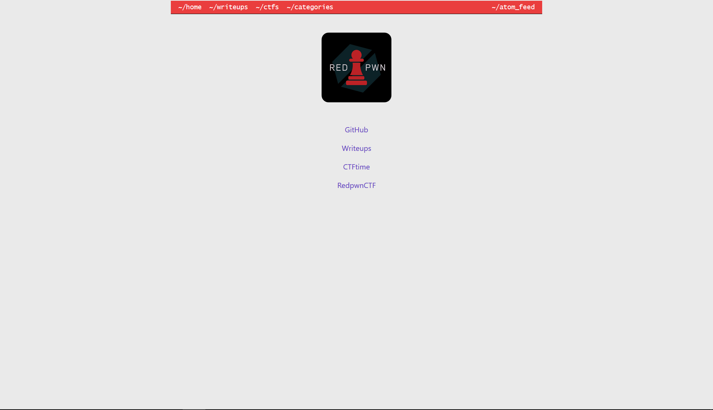

# inspector-general

1300 solves / 112 points

```txt
My friend made a new webpage, can you [find a flag](url)?
```

## 概要



writeupをまとめたサイト

- home  
ロゴとリンク達。
  - categories
  カテゴリでまとめられたwriteup
  - ctfs
  CTFごとにまとめられたwriteup
  - writeups
  全部のwriteup

スコープが広いし、writeupなので`flag{`で検索すると邪魔なのが混ざる。

## 解

ソースにflagがあることを疑って、wget;grepした。

```txt
$ wget -q -r [url];grep -r -Poi flag{.*}
writeups/hsctf2018/tiles/index.html:flag{1nspector_g3n3ral_at_w0rk}
writeups/hsctf2018/review/index.html:flag{1nspector_g3n3ral_at_w0rk}
writeups/hsctf2018/jumper/index.html:flag{1nspector_g3n3ral_at_w0rk}
writeups/hsctf2018/caesar/index.html:flag{1nspector_g3n3ral_at_w0rk}
writeups/hsctf2018/alarm/index.html:flag{1nspector_g3n3ral_at_w0rk}
writeups/picoctf2018/lambdash3/index.html:flag{1nspector_g3n3ral_at_w0rk}
writeups/picoctf2018/jbr/index.html:flag{1nspector_g3n3ral_at_w0rk}
writeups/picoctf2018/circuit123/index.html:flag{1nspector_g3n3ral_at_w0rk}
writeups/picoctf2018/circuit123/index.html:flag{Real_flag_will_be_loooooooonger_than_me}
writeups/picoctf2018/dogorfrog/index.html:flag{1nspector_g3n3ral_at_w0rk}
writeups/picoctf2018/be-quick-or-be-dead-3/index.html:flag{1nspector_g3n3ral_at_w0rk}
writeups/crackmes/cmu_binary_bomb/index.html:flag{1nspector_g3n3ral_at_w0rk}
writeups/crackmes/rpi_binary_bomb/index.html:flag{1nspector_g3n3ral_at_w0rk}
writeups/tjctf2018/abyss/index.html:flag{1nspector_g3n3ral_at_w0rk}
writeups/pactf2018/tiebreakers/index.html:flag{1nspector_g3n3ral_at_w0rk}
writeups/picoctf2019/shark-on-wire-2/index.html:flag{1nspector_g3n3ral_at_w0rk}
writeups/picoctf2019/irish-name-repo-2/index.html:flag{1nspector_g3n3ral_at_w0rk}
writeups/picoctf2019/cereal-hacker-2/index.html:flag{1nspector_g3n3ral_at_w0rk}
writeups/picoctf2019/investigation_encoded_2/index.html:flag{1nspector_g3n3ral_at_w0rk}
writeups/picoctf2019/sice_cream/index.html:flag{1nspector_g3n3ral_at_w0rk}
writeups/picoctf2019/sice_cream/index.html:flag{th3_r3al_questi0n_is_why_1s_libc_2.23_still_4_th1ng_62167e9e}
writeups/picoctf2019/b1g_mac/index.html:flag{1nspector_g3n3ral_at_w0rk}
writeups/picoctf2019/empire2/index.html:flag{1nspector_g3n3ral_at_w0rk}
writeups/picoctf2019/java_script_kiddie_2/index.html:flag{1nspector_g3n3ral_at_w0rk}
writeups/picoctf2019/empire3/index.html:flag{1nspector_g3n3ral_at_w0rk}
writeups/picoctf2019/client-side-again/index.html:flag{1nspector_g3n3ral_at_w0rk}
writeups/picoctf2019/irish-name-repo-3/index.html:flag{1nspector_g3n3ral_at_w0rk}
writeups/picoctf2019/empire1/index.html:flag{1nspector_g3n3ral_at_w0rk}
writeups/picoctf2019/ghost_diary/index.html:flag{1nspector_g3n3ral_at_w0rk}
writeups/picoctf2019/zero_to_hero/index.html:flag{1nspector_g3n3ral_at_w0rk}
writeups/dawgctf2020/thehackerone/index.html:flag{1nspector_g3n3ral_at_w0rk}
writeups/dawgctf2020/thehackerone/index.html:flag{get_em_uPy4TWP1SQlcaukrU8GPe}
writeups/index.html:flag{1nspector_g3n3ral_at_w0rk}
writeups/icectf2018/hard_shells/index.html:flag{1nspector_g3n3ral_at_w0rk}
writeups/icectf2018/twitter/index.html:flag{1nspector_g3n3ral_at_w0rk}
writeups/tjctf2020/homerolled/index.html:flag{1nspector_g3n3ral_at_w0rk}
writeups/tjctf2020/jarvis/index.html:flag{1nspector_g3n3ral_at_w0rk}
writeups/tjctf2020/jarvis/index.html:flag{mnWis_cool}
writeups/tjctf2020/jarvis/index.html:flag{ml_is_cool}
writeups/tjctf2020/cookiemonster/index.html:flag{1nspector_g3n3ral_at_w0rk}
writeups/tjctf2020/fblibrary/index.html:flag{1nspector_g3n3ral_at_w0rk}
categories/crypto:flag{1nspector_g3n3ral_at_w0rk}
categories/guess:flag{1nspector_g3n3ral_at_w0rk}
categories/web:flag{1nspector_g3n3ral_at_w0rk}
categories/reverse-engineering:flag{1nspector_g3n3ral_at_w0rk}
categories/pwn:flag{1nspector_g3n3ral_at_w0rk}
categories/forensics:flag{1nspector_g3n3ral_at_w0rk}
categories/algorithms:flag{1nspector_g3n3ral_at_w0rk}
categories/cryptography:flag{1nspector_g3n3ral_at_w0rk}
categories/index.html:flag{1nspector_g3n3ral_at_w0rk}
categories/misc:flag{1nspector_g3n3ral_at_w0rk}
categories/pyjail:flag{1nspector_g3n3ral_at_w0rk}
index.html:flag{1nspector_g3n3ral_at_w0rk}
ctfs/hsctf2018:flag{1nspector_g3n3ral_at_w0rk}
ctfs/picoctf2018:flag{1nspector_g3n3ral_at_w0rk}
ctfs/crackmes:flag{1nspector_g3n3ral_at_w0rk}
ctfs/tjctf2018:flag{1nspector_g3n3ral_at_w0rk}
ctfs/pactf2018:flag{1nspector_g3n3ral_at_w0rk}
ctfs/picoctf2019:flag{1nspector_g3n3ral_at_w0rk}
ctfs/dawgctf2020:flag{1nspector_g3n3ral_at_w0rk}
ctfs/index.html:flag{1nspector_g3n3ral_at_w0rk}
ctfs/icectf2018:flag{1nspector_g3n3ral_at_w0rk}
ctfs/tjctf2020:flag{1nspector_g3n3ral_at_w0rk}
index.xml:flag{th3_r3al_questi0n_is_why_1s_libc_2.23_still_4_th1ng_62167e9e}
```

`writeups/index.html:flag{1nspector_g3n3ral_at_w0rk}`が怪しい。  
writeupsのページはwruteupのリンクがまとめられてただけなはずだ。

`writeups/index.html`のソースコードみたら`<head>`の中に隠されてた。  
これだろう、と思いsubmitしたら正解。

```txt
flag{1nspector_g3n3ral_at_w0rk}
```
