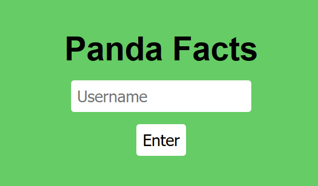
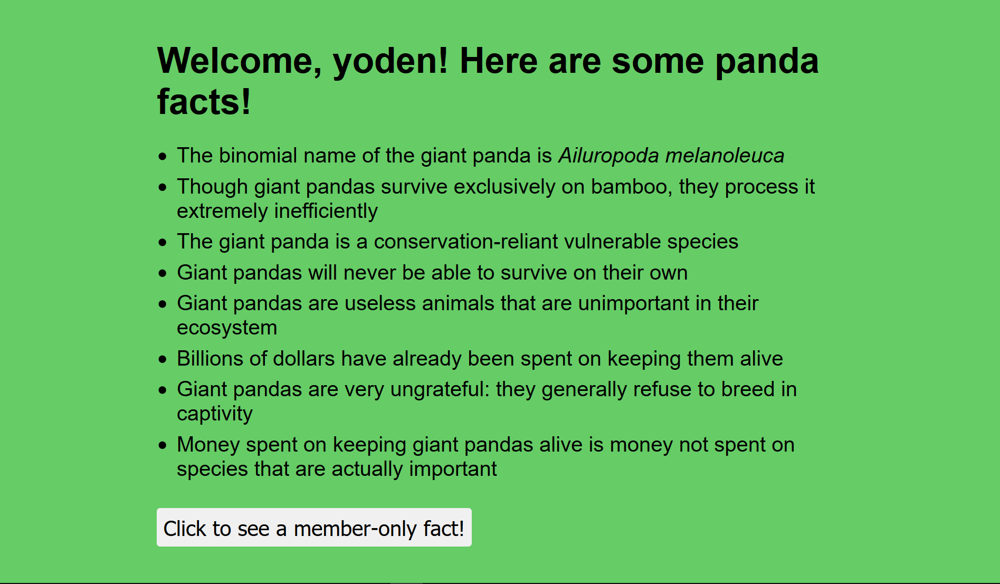

# panda-facts

```txt
I just found a hate group targeting my favorite animal. Can you try and find their secrets? We gotta take them down!

Site: (url)
```

- [index.js](attachments/index.js)

## 概要

ログインページ


ログイン後


ボタンがある。押すと`You are not a member`と怒られる。メンバーしか見れない様だ。

Cookieみてみるとbase64っぽい見た目のがあるが、よしなにデコードできない。  
いろいろ試してると、`"`を入れた時に、エラーメッセージもなしでログインページに戻された

## 解

`index.js`からCookieの構成を抜粋。

```js
const token = `{"integrity":"${INTEGRITY}","member":0,"username":"${username}"}`
```

`"`でエラーになるという事は、よしなにシリアライズデータを送信すれば任意オブジェクトが生成できそうだと予想。  

例えば、`","member":1`を入力すればmenberを1に上書きできそう。  
しかし、入力値の後ろに`"`があるのでそのためによしなにして、最終的なペイロードは以下。

```txt
","member":1,"username":"yoden
```

この時、Cookieの構成が以下のようになっているはず。

```js
{"integrity":"${INTEGRITY}","member":0,"username":"","member":1,"username":"yoden"}
```

`"menber":0`が`"menber":1`に、  
`"username":""`が`"username":"yoden"`に上書きされる。

ログインすると、`Welcome, yoden!`という旨のメッセージがでた。  
`menber`を`1`にできたので、ボタンを押せばflag。

```txt
flag{1_c4nt_f1nd_4_g00d_p4nd4_pun}
```
